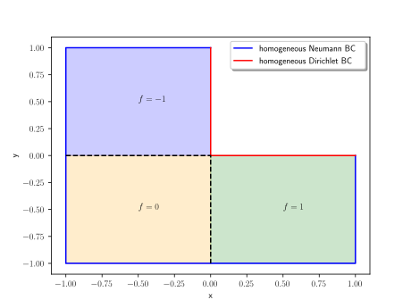

Basics of Geometric Multigrid
=============================

Introduction
^^^^^^^^^^^^

In the following, we are describing the geometric multigrid method,
which for certain problems yields an iterative solver
with optimal time complexity, i.e. the solver returns a solution to a PDE in
:math:`O(n_{\text{DoFs}})` arithmetic operations. We will show that this can also
be achieved for some convection-diffusion equations on uniformly refined triangular
meshes, when discretizing with linear finite elements.

Problem setup
^^^^^^^^^^^^^
Let :math:`\Omega := (-1,1)^2 \setminus (0,1)^2` be an L-shaped domain. We decompose the boundary of this domain :math:`\partial\Omega` into the Neumann boundary :math:`\Gamma_N := (0,1) \times \{0\} \cup \{0\} \times (0,1)`
and the Dirichlet boundary :math:`\Gamma_D := \partial\Omega \setminus \Gamma_N`.

Next, we define the ansatz and test function space :math:`V := \left\{ u \in H^1(\Omega)\mid u = 0 \text{ on } \Gamma_D \right\}`,
where

.. math::

  H^1(\Omega) := W^{1,2}(\Omega) := \left\{ u \in L^2(\Omega) \mid \nabla u \in L^2( \Omega ) \right\}

is the Sobolev space containing the weakly differentiable functions
in :math:`\Omega`. Note that we haven't explicitly prescribed any boundary conditions on :math:`\Gamma_N` in the function space,
since the homogeneous Neumann boundary conditions come up naturally when deriving the variational form of the problem.
Further, we need a right hand side function

.. math::

   f(x) :=
   \begin{cases}
      -1 & \text{for } x \in (-1,0) \times (0,1) \\
      0 & \text{for } x \in (-1,0) \times (-1,0) \\
      1 & \text{for } x \in (0,1) \times (-1,0) \\
   \end{cases}.

    Figure 1: Domain :math:`\Omega`

Using the parameters :math:`a = 1` and :math:`c = 0` in :math:`\Omega`, we can now
formulate the strong form of our convection diffusion equation:

.. admonition:: Strong form

  Find :math:`u: \Omega \rightarrow \mathbb{R}` such that

  .. math::

    -\nabla \cdot \left( a \nabla u\right) + c u &= f \quad \text{in } \Omega \qquad (1)\\
    u &= 0 \quad \text{on } \Gamma_D \\
    \partial_n u &= 0 \quad \text{on } \Gamma_N

In the above formulation, we used the notation :math:`\partial n := \nabla \cdot n`.
To be able to solve this problem, we need to convert it into its integral form.
Therefore we multiply (1) from the right with a test function :math:`v \in V` and integrate over :math:`\Omega`.

.. math::

   -\int_{\Omega} \left(\nabla \cdot \left( a \nabla u\right)\right) \cdot v\ dx
   + \int_{\Omega} c u \cdot v\ dx
   = \int_{\Omega} f \cdot v\ dx \quad \forall v \in V

Now integration of parts can be applied to the first integral and we use the fact that :math:`\partial \Omega = \Gamma_D\ \dot\cup\ \Gamma_N`.

.. math::

   \int_{\Omega} a \nabla u \cdot \nabla v\ dx
   -\int_{\Gamma_D} a \partial_n u \cdot v\ ds
   -\int_{\Gamma_N} a \partial_n u \cdot v\ ds \\
   + \int_{\Omega} c u \cdot v\ dx
   = \int_{\Omega} f \cdot v\ dx \quad \forall v \in V

Note that the integrals over the boundaries :math:`\Gamma_D` and :math:`\Gamma_N` vanish,
since :math:`\partial_n u = 0` on :math:`\Gamma_N` and, due to :math:`v \in V`, :math:`u = 0` on :math:`\Gamma_D`.
Thus we have derived the following integral problem of our problem,
which is often referred to as the weak or variational form in the literature.

.. admonition:: Weak form

  Find :math:`u \in V` such that

  .. math::

    a(u,v) = l(v) \quad \forall v \in V

  where :math:`a: V \times V \rightarrow \mathbb{R}` is the bilinear form defined as

  .. math::

    a(u,v) := \int_{\Omega} a \nabla u \cdot \nabla v\ dx + \int_{\Omega} c u \cdot v\ dx

  and the right hand side :math:`l: V \rightarrow \mathbb{R}` is a linear form defined as

  .. math::

    l(v) := \int_{\Omega} f \cdot v\ dx

Furthermore using the fundamental lemma of calculus of variations, it can be shown that the strong and the weak form
are equivalent. Hence it suffices to solve the weak form of the problem.

Finite Element Method
^^^^^^^^^^^^^^^^^^^^^
TODO !!!

Grid Setup
^^^^^^^^^^
To transform the weak form of our problem into a linear equation system,
we first need to discretize our domain. For that purpose, we create an initial triangulation of the domain,
i.e. we divide :math:`\Omega` into a set of triangles. We call this triangulation the coarse grid and denote it as :math:`\mathbb{T}_0`.
The grid consists of objects of type :code:`Node`, :code:`Edge` and :code:`Triangle`.

.. figure:: img/CoarseGrid.svg
    :alt: coarse_grid
    :align: center

    Figure 2: Coarse grid (:math:`\mathbb{T}_0`)

For the multigrid method, we need a sequence of such grids.
In this work, we restrict our analysis to uniformly refined meshes.
How can we create these refined meshes? We have to loop over all triangles of the grid
and then refine them.

.. figure:: img/triangle_refinement.svg
    :alt: triangle_refinement
    :align: center

    Figure 3: Refining a triangle

To refine a triangle one simply needs to bisect all of its edges and draw a new triangle out of these three new nodes.
As shown in figure 3, through the refinement process a triangle is being divided
into four smaller triangles. father son list, table 

Two Grid Method
^^^^^^^^^^^^^^^

TODO: Code Examples !!!!!

::

   >>> from activations import Softmax
   >>> f = Softmax()

14.09.

References
^^^^^^^^^^
#. Sven Beuchler. *Lecture notes in 'Multigrid and domain decomposition.'* April 2020.
#. Thomas Wick. *Numerical Methods for Partial Differential Equations.* 2020, pp. 229-240. URL: `https://doi.org/10.15488/9248 <https://doi.org/10.15488/9248>`__.
#. Dietrich Braess. *Finite Elemente.* Springer Berlin Heidelberg, 2013. DOI: 10.1007/978-3-642-34797-9. URL: `https://doi.org/10.1007%2F978-3-642-34797-9 <https://doi.org/10.1007%2F978-3-642-34797-9>`__.
