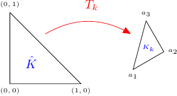
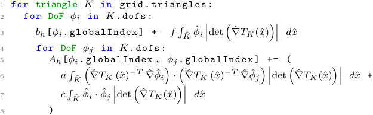
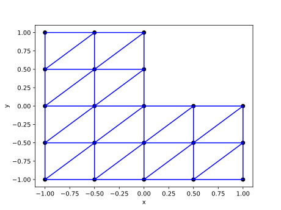
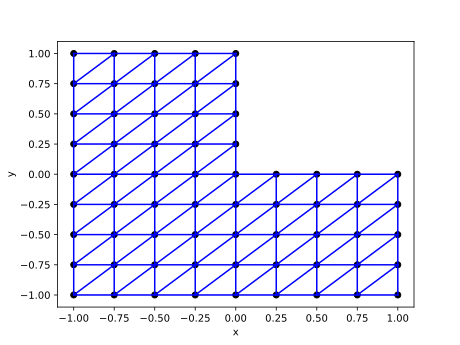

Basics of Geometric Multigrid
=============================

.. raw:: html

    

.. role:: blue

.. raw:: html

    

.. role:: red

Introduction
^^^^^^^^^^^^
In the following, we are describing the :blue:`geometric multigrid method`,
which for certain problems yields an iterative solver
with optimal cost complexity, i.e. the solver returns a solution to a PDE in
:math:`O(n_{\text{DoFs}})` arithmetic operations. We will show that this can also
be achieved for some convection-diffusion equations on uniformly refined triangular
meshes, when discretizing with linear finite elements.

Problem setup
^^^^^^^^^^^^^
Let :math:`\Omega := (-1,1)^2 \setminus (0,1)^2` be an L-shaped :blue:`domain`. We decompose the boundary of this domain :math:`\partial\Omega` into the Dirichlet boundary :math:`\Gamma_D := (0,1) \times \{0\} \cup \{0\} \times (0,1)`
and the Neumann boundary :math:`\Gamma_N := \partial\Omega \setminus \Gamma_D`.

Next, we define the :blue:`ansatz` and :blue:`test function space` :math:`V := \left\{ u \in H^1(\Omega)\mid u = 0 \text{ on } \Gamma_D \right\}`,
where

.. math::

  H^1(\Omega) := W^{1,2}(\Omega) := \left\{ u \in L^2(\Omega) \mid |\nabla u| \in L^2( \Omega ) \right\}

is the Sobolev space containing the weakly differentiable functions
in :math:`\Omega`. Note that we haven't explicitly prescribed any boundary conditions on :math:`\Gamma_N` in the function space,
since the homogeneous Neumann boundary conditions come up naturally when deriving the variational form of the problem.
Further, we need a right hand side function

.. math::

   f(x) :=
   \begin{cases}
      -1 & \text{for } x \in (-1,0) \times (0,1) \\
      0 & \text{for } x \in (-1,0) \times (-1,0) \\
      1 & \text{for } x \in (0,1) \times (-1,0) \\
   \end{cases}.

.. figure:: img/domain.svg
    :alt: domain
    :align: center

.. centered:: Figure 1: Domain :math:`\Omega`

Using the parameters :math:`a = 1` and :math:`c = 0` in :math:`\Omega`, we can now
formulate the strong form of our convection diffusion equation:

.. admonition:: Strong form

  Find :math:`u: \Omega \rightarrow \mathbb{R}` such that

  .. math::

    -\nabla \cdot \left( a \nabla u\right) + c u &= f \quad \text{in } \Omega \qquad (1)\\
    u &= 0 \quad \text{on } \Gamma_D \\
    \partial_n u &= 0 \quad \text{on } \Gamma_N

In the above formulation, we used the notation :math:`\partial n := \nabla \cdot n`.
To be able to solve this problem, we need to convert it into its integral form.
Therefore we multiply (1) from the right with a test function :math:`v \in V` and integrate over :math:`\Omega`.

.. math::

   -\int_{\Omega} \left(\nabla \cdot \left( a \nabla u\right)\right) \cdot v\ dx
   + \int_{\Omega} c u \cdot v\ dx
   = \int_{\Omega} f \cdot v\ dx \quad \forall v \in V

Now integration of parts can be applied to the first integral and we use the fact that :math:`\partial \Omega = \Gamma_D\ \dot\cup\ \Gamma_N`.

.. math::

   \int_{\Omega} a \nabla u \cdot \nabla v\ dx
   -\int_{\Gamma_D} a \partial_n u \cdot v\ ds
   -\int_{\Gamma_N} a \partial_n u \cdot v\ ds \\
   + \int_{\Omega} c u \cdot v\ dx
   = \int_{\Omega} f \cdot v\ dx \quad \forall v \in V

Note that the integrals over the boundaries :math:`\Gamma_D` and :math:`\Gamma_N` vanish,
since :math:`\partial_n u = 0` on :math:`\Gamma_N` and, due to :math:`v \in V`, :math:`u = 0` on :math:`\Gamma_D`.
Thus we have derived the following integral problem of our problem,
which is often referred to as the weak or variational form in the literature.

.. admonition:: Weak form

  Find :math:`u \in V` such that

  .. math::

    a(u,v) = l(v) \quad \forall v \in V

  where :math:`a: V \times V \rightarrow \mathbb{R}` is the bilinear form defined as

  .. math::

    a(u,v) := \int_{\Omega} a \nabla u \cdot \nabla v\ dx + \int_{\Omega} c u \cdot v\ dx

  and the right hand side :math:`l: V \rightarrow \mathbb{R}` is a linear form defined as

  .. math::

    l(v) := \int_{\Omega} f \cdot v\ dx

Furthermore using the fundamental lemma of calculus of variations, it can be shown that the strong and the weak form
are equivalent. Hence it suffices to solve the weak form of the problem.

Finite Element Method
^^^^^^^^^^^^^^^^^^^^^
The problem that we are facing is that :math:`V` is an infinite dimensional function space
and we need the ability to solve the weak form with a classical computer.
Hence instead we work with a finite dimensional subspace :math:`V_h \subset V`.
This will enable us to rewrite the weak form as a linear equation system.

Let a subdivision of :math:`\Omega` into :blue:`finite elements` :math:`(K,P_1,\Sigma)`
be given, where

* :math:`K` is a two dimensional right triangle,
* :math:`P_1(K) := \operatorname{span}\{1-x_1-x_2, x_1, x_2 \}` is the space of linear functions defined on :math:`K`,
* :math:`\Sigma := \{a_0, a_1, a_2 \}` is a set of :blue:`degrees of freedom` (DoF), which here are the values of the polynomial at the vertices of :math:`K`.

Then a :math:`P_1(K)` function is defined by

.. math::

  u(x) = a_0 + a_1x_1 + a_2x_2 \quad \forall x = (x_1,x_2) \in K.

To recapitulate: First, we have divided :math:`\Omega` into triangles :math:`K_1, ..., K_m`. Examples for this can be found in the section `"Grid Setup" <#grid-setup>`__.
Secondly, we have seen that we have the parameters (DoFs) which can describe any linear function on such a triangle :math:`K_k`.
Now simply define our function space :math:`V_h` as the space of functions which are continuous on the whole domain :math:`\Omega`, linear on each triangle :math:`K_k` and satisfy the Dirichlet boundary conditions, i.e.

.. math::

  V_h := \{ v_h \in C(\Omega) \mid v_h |_{K_k} \in P_1(K_k) \quad \forall 1 \leq k \leq m,\ v_h = 0 \text{ on } \Gamma_D \}.

We use the index :math:`h` to show that we are not longer using the infinite dimensional function space :math:`V`,
but a finite dimensional subspace which is defined on triangles :math:`K_k` where the short sides have length :math:`h`.
By working with :math:`V_h`, we now try to find an element-wise linear approximation to the solution of the weak form.

Thus we are now trying to solve the discrete weak form:

.. admonition:: Discrete weak form

  Find :math:`u_h \in V_h` such that

  .. math::

    a(u_h,v_h) = l(v_h) \quad \forall v_h \in V_h

Furthermore, we know that :math:`V_h` is finite dimensional and we can write down its basis, since we know the bases of :math:`P_1(K_k)`.
Hence

.. math::

  V_h = \operatorname{span}\{ \phi_1, \dots, \phi_{n_{DoFs}} \},

where :math:`\phi_i` is the basis function corresponding to the i.th degree of freedom, i.e. the i.th grid point. It follows that

.. math::

  u_h = \sum_{i= 0}^{n_{DoFs}} u_i \phi_i \quad \text{and} \quad v_h = \sum_{i= 0}^{n_{DoFs}} v_i \phi_i

for some :math:`\begin{pmatrix}u_1, \dots u_{n_{DoFs}}\end{pmatrix}^T, \begin{pmatrix}v_1, \dots v_{n_{DoFs}}\end{pmatrix}^T \in \mathbb{R}^{n_{DoFs}}`. Therefore the discrete weak form can be written as

.. math::

  a\left(\sum_{i= 0}^{n_{DoFs}} u_i \phi_i,\sum_{j= 0}^{n_{DoFs}} v_j \phi_j \right) = l\left(\sum_{j= 0}^{n_{DoFs}} v_j \phi_j \right).

Since :math:`a` is linear in the second argument and :math:`l` is also linear, it is thus sufficient to solve

.. math::

  a\left(\sum_{i= 0}^{n_{DoFs}} u_i \phi_i,\phi_j \right) = l\left(\phi_j \right) \quad \forall 1 \leq j \leq n_{DoFs}.

The convection-diffusion problem is linear itself, thus :math:`a` is also linear in the first argument and we get

.. math::

  \sum_{i= 0}^{n_{DoFs}} u_i\ a\left(\phi_i,\phi_j \right) = l\left(\phi_j \right) \quad \forall 1 \leq j \leq n_{DoFs}.

This can also be written as a linear equation system

.. math::

  \begin{bmatrix}
    a\left(\phi_1,\phi_1 \right) & \cdots & a\left(\phi_{n_{DoFs}},\phi_1 \right) \\
    \vdots & \ddots & \vdots \\
    a\left(\phi_1,\phi_{n_{DoFs}} \right) & \cdots & a\left(\phi_{n_{DoFs}},\phi_{n_{DoFs}} \right)
  \end{bmatrix}
  \begin{bmatrix}
    u_1\\
    \vdots\\
    u_{n_{DoFs}}
  \end{bmatrix}
  =
  \begin{bmatrix}
    l(u_1)\\
    \vdots\\
    l(u_{n_{DoFs}})
  \end{bmatrix}.

To remain consistent with future chapters, we follow the naming convention

.. math::

  A_h &:= \begin{bmatrix}
    a\left(\phi_1,\phi_1 \right) & \cdots & a\left(\phi_{n_{DoFs}},\phi_1 \right) \\
    \vdots & \ddots & \vdots \\
    a\left(\phi_1,\phi_{n_{DoFs}} \right) & \cdots & a\left(\phi_{n_{DoFs}},\phi_{n_{DoFs}} \right)
  \end{bmatrix}, \\
  x_h &:= \begin{bmatrix}
    u_1\\
    \vdots\\
    u_{n_{DoFs}}
  \end{bmatrix}  \quad \text{ and } \\
  b_h &:= \begin{bmatrix}
    l(u_1)\\
    \vdots\\
    l(u_{n_{DoFs}})
  \end{bmatrix}.

To be able to solve :math:`A_h x_h = b_h`, we need an efficient way to compute :math:`a\left(\phi_i,\phi_j \right)` and :math:`l\left(\phi_j \right)`.
For that we use that :math:`\Omega = \cup_{k = 1}^{n_{DoFs}}K_k` and we thus get

.. math::

  a(\phi_i,\phi_j) &= \int_{\Omega} a \nabla \phi_i \cdot \nabla \phi_j\ dx + \int_{\Omega} c \phi_i \cdot \phi_j\ dx \\
                  &= \sum_{k = 1}^{n_{DoFs}} \left( \int_{K_k} a \nabla \phi_i \cdot \nabla \phi_j\ dx + \int_{K_k} c \phi_i \cdot \phi_j\ dx  \right),

similarly we get for the right hand functional

.. math::

  l(\phi_j) &= \int_{\Omega} f \cdot \phi_j\ dx \\
            &= \sum_{k = 1}^{n_{DoFs}} \left( \int_{K_k} f \cdot \phi_j\ dx \right).

Note that many of these integrals are zero, since the basis functions :math:`\phi_i` only have support on the triangles that contain the vertex corresponding
to the i.th degree of freedom. Furthermore, we use the isoparametric concept that allows us to assemble the :blue:`system matrix` :math:`A_h` and :blue:`right side` :math:`b_h`
by once computing integrals on a reference element :math:`\hat{K}` and then transforming the results to the elements :math:`K_k`.

.. centered:: Figure 2: Transformation from reference element to finite element

We now apply the transformation theorem

.. math::

  \int_{\hat{K}} g\left(T_k\left(\hat{x}\right)\right)\left|\det\left(\nabla T_k\left(\hat{x}\right)\right)\right|\ d\hat{x} = \int_{K_k} g\left(x\right)\ dx

to all integrals that need to be evaluated in the discrete weak form.

.. elaborate on this section

Then the algorithm for the assembly is given by

where :math:`\hat{\phi}_i = \phi_i \circ T_k` are the basis functions on the reference element.

At the end of the assembly, we need to account for the Dirichlet boundary constraints, e.g. let a constraint :math:`u_{\tau} = \xi` be given.
Then we would need to make sure that :math:`(A_h)_{\tau,j} = \delta_{\tau,j}` for all :math:`1 \leq j \leq m`.
Here :math:`\delta_{\tau,j}` denotes the Kronecker delta, which is defined as

.. math::

  \delta_{\tau,j} := \begin{cases}
    1 & \text{for } j = \tau \\
    0 & \text{for } j \neq \tau
    \end{cases}.

Futhermore, we would need to set :math:`(b_h)_{\tau} = \xi`.
Obviously these steps ensure that when solving the linear system :math:`A_h x_h = b_h`,
we get :math:`u_{\tau} = \xi`. In our model problem, we only have homogeneous Dirichlet constraints.
Thus, we only need to find all indices :math:`\tau` at the Dirichlet boundary :math:`\Gamma_D`
and apply the procedure from above with :math:`\xi = 0`.

Overall, the Finite Element Method enabled us to transform a discrete form of the convection-diffusion equation
on a given grid into a linear equation system. In the following, we will investigate how such a linear equation system can be solved iteratively.

Iterative Methods
^^^^^^^^^^^^^^^^^
We want to construct an iteration, where each iterate :math:`x_k^{k}` is a better approximation to the linear equation system :math:`A_h x_h = b_h`.
To measure the quality of our solution, we monitor the :blue:`defect`

.. math::
  b_h - A_h x_h

and try to minimize it.
One can try to formulate a fixed point scheme :math:`x_h^{k+1} = g\left(x_h^{k}\right)` to solve the system of equations.
The goal of the fixed point scheme is to find some input :math:`x` such that :math:`g(x) = x`.
In our case, we want the exact solution :math:`x_h` to be a fixed point of our iteration.
We observe that the defect of the exact solution is zero. Thus one might try to increment the old iterate :math:`x_h`
by some multiple of the defect. This is called the Richardson method. However, the Richardson method is rarely used in practice.
Instead we will work with the more general fixed point scheme

.. math::

  x_h^{k+1} = x_h^{k} + \omega C^{-1}\left(b_h - A_h x_h^{k} \right)

where :math:`C \in \mathbb{R}^{n_{DoFs} \times n_{DoFs}}`. Here the type of method depends on the matrix :math:`C`, e.g.
:math:`C = I` is the Richardson method. In our code, we implemented

* :math:`C = D` which is the :math:`\omega`-:blue:`Jacobi` method,
* :math:`C = \left( D + L \right)` which is the  :blue:`Forward Gauss-Seidel` method for :math:`\omega = 1`,
* :math:`C = \left( D + U \right)` which is the  :blue:`Backward Gauss-Seidel` method for :math:`\omega = 1`.

In these definitions, we used the decomposition  :math:`A_h = L + D + U`, where :math:`L` has only nonzero entries below the diagonal (strictly lower triangular matrix),
:math:`D` has only nonzero entries on the diagonal (diagonal matrix) and :math:`U` has only nonzero entries above the diagonal (strictly upper triangular matrix).

Note that we need to compute the inverse matrix :math:`C^{-1}`. This can be easily done for :math:`\omega`-Jacobi,
since we just invert the diagonal. It wouldn't be efficient to invert :math:`\left( D + L \right)` or :math:`\left( D + U \right)` directly.
Hence we use the formula

.. math::

  x_i^k = \frac{1}{a_{ii}}\left( b_i - \sum_{j < i}a_{ij}x_j^k - \sum_{j > i}a_{ij}x_j^{k-1} \right) \quad \text{for } i = 1, \dots n_{DoFs}

for Forward Gauss-Seidel and the formula

.. math::

  x_i^k = \frac{1}{a_{ii}}\left( b_i - \sum_{j < i}a_{ij}x_j^{k-1} - \sum_{j > i}a_{ij}x_j^{k} \right) \quad \text{for } i = n_{DoFs},  \dots, 1

for Backward Gauss-Seidel. In these formulas, we used the notation :math:`a_{ij} := (A_h)_{ij}`, :math:`b_{i} := (b_h)_{i}` and :math:`x_i^{k} := (x_h^{k})_i`.

Which of these iterative methods should be used in numerical computations? It depends!
:math:`\omega`-Jacobi has the benefit of being fast, since it can be parallelized.
Nevertheless, it needs more iterations to converge than Gauss-Seidel and one needs to choose a good value for :math:`\omega` before computation.
Although the Gauss-Seidel methods converge in less iterations, they need longer for the computation, since the for loops need to be executed sequentially.

In the next few sections, we will show how :math:`\omega`-Jacobi and Gauss-Seidel can be used in the multigrid method,
resulting in a fast solver for the linear equation system derived from a discrete weak form of the convection-diffusion equation.

Grid Setup
^^^^^^^^^^
To transform the weak form of our problem into a linear equation system,
we first need to discretize our domain. For that purpose, we create an initial triangulation of the domain,
i.e. we divide :math:`\Omega` into a set of triangles. We call this triangulation the :blue:`coarse grid` and denote it as :math:`\mathbb{T}_0`.
The grid consists of objects of type :code:`Node`, :code:`Edge` and :code:`Triangle`.

.. figure:: img/CoarseGrid.svg
    :alt: coarse_grid
    :align: center

.. centered:: Figure 3: Coarse grid (:math:`\mathbb{T}_0`)

For the multigrid method, we need a sequence of such grids.
In this work, we restrict our analysis to uniformly refined meshes.
How can we create these refined meshes? We have to loop over all triangles of the grid
and then refine them.

.. figure:: img/triangle_refinement.svg
    :alt: triangle_refinement
    :align: center

.. centered:: Figure 4: Refining a triangle

To refine a triangle one simply needs to bisect all of its edges and draw a new triangle out of these three new nodes.
As shown in figure 4, through the refinement process a triangle is being divided
into four smaller triangles. Each :code:`Node` object needs to know its parent nodes.
The parents are two end nodes of the edge that has been bisected, e.g. node 1 and node 2 are the parents of node 4.
In the literature [1] these relationships are being stored in a father-son list.
This is not needed in our case, due to Object Oriented Programming (OOP).

Having refined all triangles of the coarse grid, we get a new triangulation :math:`\mathbb{T}_1`,
which is called the grid on level 1. The :blue:`level` of a grid indicates how often we need to (globally)
refine the coarse grid to construct that grid.

.. centered:: Figure 5: Grid on level 1 (:math:`\mathbb{T}_1`)

We continue the process of refining the grid, until we end up with a grid, which has enough nodes
to ensure that a sufficiently good approximation to the exact solution can be computed.

.. centered:: Figure 6: Grid on level 2 (:math:`\mathbb{T}_2`)

The grid on the highest level, in this case :math:`\mathbb{T}_2` or more generally :math:`\mathbb{T}_L`, is called the finest grid
and will be used to assemble the system matrix.

Using the Finite Element Method, we can discretize the weak form of our PDE on each level grid
with linear finite elements. For each level :math:`0 \leq l \leq L`, we get a linear equation system

.. math::

   A_l x_l = b_l \text{  with  } A_l \in \mathbb{R}^{n_l \times n_l}, x_l, b_l \in \mathbb{R}^{n_l},

where :math:`n_l` is the number of degrees of freedom (DoFs), which in our case corresponds to the number of nodes in the grid.
Note that the discrete function spaces :math:`\left( V_l \right)_{l=0}^L` from the FEM are conforming finite element spaces,
i.e. :math:`V_0 \subset V_1 \subset \cdots \subset V_L`. If this wasn't the case, the grid transfer operations, which will be introduced shortly, would need to be modified.

Two-grid algorithm
^^^^^^^^^^^^^^^^^^
To understand the multigrid algorithm we start by looking at the case where we only have two grids :math:`\mathbb{T}_{l}` and :math:`\mathbb{T}_{l+1}`.
The mulitgrid algorithm is then only a recursive application of the two grid version.

.. admonition:: Two-grid algorithm

  Let :math:`A_h x_h = b_h` and :math:`A_{2h} x_{2h} = b_{2h}` with :math:`A_h \in \mathbb{R}^{n \times n}`,
  :math:`A_{2h} \in \mathbb{R}^{m \times m}` and :math:`m < n`
  denote the linear equation systems from the grids :math:`\mathbb{T}_{l+1}` and :math:`\mathbb{T}_{l}`.
  Let the k-th iterate :math:`x_h^k` on the finer grid be given.

  .. figure:: img/tgm_trans.png
      :alt: tgm
      :align: center

.. hint::

  In most cases we want the two-grid method to be a symmetric iteration.
  Therefore we need :math:`\nu := \nu_1 = \nu_2` and :math:`S := S_1 = S_2^\ast` [4],
  e.g. choose :math:`S_1` as forward Gauss-Seidel and :math:`S_2` as backward Gauss-Seidel.
  Alternatively we have also implemented the :math:`\omega`-Jacobi method which can be used for pre- and post-smoothing.
  Furthermore :math:`A_{2h}^{-1}d_{2h}` is not feasible to compute with a direct solver
  if :math:`A_{2h}` is too large, which is often the case.
  Thus :math:`A_{2h}^{-1}d_{2h}` can be understood as solving the linear equation system and can be done for example by another two-grid method. This recursion then produces the multigrid algorithm.

Multigrid algorithm
^^^^^^^^^^^^^^^^^^^
.. admonition:: Multigrid algorithm

  Let :math:`A_L x_L = b_L` denote the problem on the finest grid and :math:`A_l x_l = b_l`
  the problems on the coarser grids for :math:`0 \leq l \leq L-1`.
  Let :math:`\nu` denote the number of pre- and post-smoothing steps.
  Let the k-th iterate :math:`x_l^k` on the l-th level be given.

  .. figure:: img/mgm_trans.png
      :alt: mgm
      :align: center

The parameter :math:`\mu \in \mathbb{N}^+` determines the :blue:`cycle` of the multigrid iteration.
For :math:`\mu = 1` we get the V-cycle

.. tikz::

   \node (A) at (0,3) [circle, minimum size=2mm, inner sep=0pt,draw] {};
   \node (B) at (1,2) [circle, minimum size=2mm, inner sep=0pt,draw] {};
   \node (C) at (2,1) [circle, minimum size=2mm, inner sep=0pt,draw] {};
   \node (D) at (3,0) [circle, minimum size=2mm, inner sep=0pt,fill = black, draw] {};
   \node (E) at (4,1) [circle, minimum size=2mm, inner sep=0pt,draw] {};
   \node (F) at (5,2) [circle, minimum size=2mm, inner sep=0pt,draw] {};
   \node (G) at (6,3) [circle, minimum size=2mm, inner sep=0pt,draw] {};

   \node [color=black] at (-1,3) {\tiny $l = 3$};
   \node [color=black] at (-1,2) {\tiny $l = 2$};
   \node [color=black] at (-1,1) {\tiny $l = 1$};
   \node [color=black] at (-1,0) {\tiny $l = 0$};

   {\color{blue}
   \draw[->] (A) to (B);
   \draw[->] (B) to (C);
   \draw[->] (C) to (D);
   }

   {\color{black!40!green}
   \draw[->] (D) to (E);
   \draw[->] (E) to (F);
   \draw[->] (F) to (G);
   }

.. centered:: Figure 7: V-cycle

and for :math:`\mu = 2` we get the W-cycle.

.. tikz::

   \node (A) at (0,3) [circle, minimum size=2mm, inner sep=0pt,draw] {};
   \node (B) at (1,2) [circle, minimum size=2mm, inner sep=0pt,draw] {};
   \node (C) at (2,1) [circle, minimum size=2mm, inner sep=0pt,draw] {};
   \node (D) at (3,0) [circle, minimum size=2mm, inner sep=0pt,fill = black, draw] {};
   \node (E) at (4,1) [circle, minimum size=2mm, inner sep=0pt,draw] {};
   \node (F) at (5,0) [circle, minimum size=2mm, inner sep=0pt,fill = black, draw] {};
   \node (G) at (6,1) [circle, minimum size=2mm, inner sep=0pt,draw] {};
   \node (H) at (7,2) [circle, minimum size=2mm, inner sep=0pt,draw] {};
   \node (I) at (8,1) [circle, minimum size=2mm, inner sep=0pt,draw] {};
   \node (J) at (9,0) [circle, minimum size=2mm, inner sep=0pt,fill = black, draw] {};
   \node (K) at (10,1) [circle, minimum size=2mm, inner sep=0pt,draw] {};
   \node (L) at (11,0) [circle, minimum size=2mm, inner sep=0pt,fill = black, draw] {};
   \node (M) at (12,1) [circle, minimum size=2mm, inner sep=0pt,draw] {};
   \node (N) at (13,2) [circle, minimum size=2mm, inner sep=0pt,draw] {};
   \node (O) at (14,3) [circle, minimum size=2mm, inner sep=0pt,draw] {};

   \node [color=black] at (-1,3) {\scriptsize $l = 3$};
   \node [color=black] at (-1,2) {\scriptsize $l = 2$};
   \node [color=black] at (-1,1) {\scriptsize $l = 1$};
   \node [color=black] at (-1,0) {\scriptsize $l = 0$};

   {\color{blue}
   \draw[->] (A) to (B);
   \draw[->] (B) to (C);
   \draw[->] (C) to (D);
   }

   {\color{black!40!green}
   \draw[->] (D) to (E);
   }
   {\color{blue}
   \draw[->] (E) to (F);
   }
   {\color{black!40!green}
   \draw[->] (F) to (G);
   \draw[->] (G) to (H);
   }
   {\color{blue}
   \draw[->] (H) to (I);
   \draw[->] (I) to (J);
   }
   {\color{black!40!green}
   \draw[->] (J) to (K);
   }
   {\color{blue}
   \draw[->] (K) to (L);
   }
   {\color{black!40!green}
   \draw[->] (L) to (M);
   \draw[->] (M) to (N);
   \draw[->] (N) to (O);
   }

.. centered:: Figure 8: W-cycle

In the figures of these schemes, white circles stand for :math:`\nu` steps of an iterative solver,
black circles represent a direct solver, blue arrows illustrate a restriction and green arrows illustrate a prolongation.

Grid transfer
^^^^^^^^^^^^^
As we have seen in the previous sections, the multigrid algorithm requires the ability to
prolongate vectors from :math:`\mathbb{R}^{n_{l}}` to :math:`\mathbb{R}^{n_{l-1}}`.
We will only show how the grid transfer operations work for conforming finite elements.
For information on how to deal with non-conforming finite element spaces, please refer to [3].
Let :math:`\left\{\varphi_1^l, \dots, \varphi_{n_{l}}^l\right\}` and
:math:`\left\{\varphi_1^{l-1}, \dots, \varphi_{n_{l-1}}^{l-1}\right\}` be some given bases of
:math:`V^l` and :math:`V^{l-1}`.
Due to the conformity of the finite element spaces,
:math:`V^{l-1} \subset V^l` holds and there exists a matrix :math:`I^{l-1}_l \in \mathbb{R}^{n_{-1} \times n_l}`
such that

.. math::

  \begin{pmatrix}
  \varphi_1^{l-1} \\
  \vdots \\
  \varphi_{n_{l-1}}^{l-1}
  \end{pmatrix} = I^{l-1}_l
  \begin{pmatrix}
  \varphi_1^{l} \\
  \vdots \\
  \varphi_{n_{l}}^{l}
  \end{pmatrix}.

The matrix :math:`I^{l-1}_l` is called the :blue:`restriction matrix` and its transpose :math:`I^{l}_{l-1} = \left(I^{l-1}_l\right)^T` is called the :blue:`prolongation matrix.`
These matrices are dependent on the finite elements that are being used and on the way that the grids have been refined.
They have only very few non-zero entries and thus are stored as sparse matrices.
Furthermore, they also have a significant impact on the rate of convergence of the multigrid algorithm [3]].
Additionally, for linear partial differential equations the identity

.. math::

  A_{l-1} = I^{l}_{l-1} A_l I^{l-1}_l

is fulfilled. Before taking a look at the actual implementation in our code,
it is helpful to a see how the the grid transfer works for one dimensional linear finite elements.

.. admonition:: Grid transfer in 1D

  .. figure:: img/grid_transfer.png
      :alt: grid_transfer
      :align: center

  .. centered:: Figure 9: Basis functions on the first two levels

  It holds

  .. math::

    \varphi_1^0 &= \varphi_1^1 + \frac{1}{2}\varphi_3^1, \\
    \varphi_2^0 &= \varphi_2^1 + \frac{1}{2}\varphi_3^1.

  Consequently the restriction matrix reads

  .. math::

    I_1^0 =
    \begin{bmatrix}
    1 & & \frac{1}{2} \\
    & 1 & \frac{1}{2}
    \end{bmatrix}.

We decided to follow these rules to create the interpolation matrix :math:`I_{l-1}^l`:

* if the i.th node already exists on level :math:`{l-1}`, then :math:`\left(I_{l-1}^l\right)_{i,i} = 1`
* else get the indices of the parents of the i.th node, then :math:`\left(I_{l-1}^l\right)_{i,\text{parent}_1} = \frac{1}{2}` and :math:`\left(I_{l-1}^l\right)_{i,\text{parent}_2} = \frac{1}{2}`

The rest of this matrix is filled with zeros. Doing this for :math:`{l=1}` yields the prolongation matrix

.. math::

  I_0^1 =
  \begin{bmatrix}
  1 & & & & & & &  \\
  & 1 & & & & & &  \\
  & & 1 & & & & &  \\
  & & & 1 & & & &  \\
  & & & & 1 & & &  \\
  & & & & & 1 & &  \\
  & & & & & & 1 &  \\
  & & & & & & & 1  \\
  \frac{1}{2}&\frac{1}{2} & & & & & &  \\
  & \frac{1}{2}&\frac{1}{2} & & & & &  \\
  \frac{1}{2}& & &\frac{1}{2} & & & & \\
  & \frac{1}{2}& & & \frac{1}{2}& & & \\
  & & &\frac{1}{2} &\frac{1}{2} & & & \\
  & &\frac{1}{2} & & &\frac{1}{2} & & \\
  & & & &\frac{1}{2} &\frac{1}{2} & & \\
  & & & \frac{1}{2}& & & \frac{1}{2}&  \\
  & & & & \frac{1}{2}& & & \frac{1}{2}\\
  & & & & & & \frac{1}{2}& \frac{1}{2}\\
  \frac{1}{2}& & & &\frac{1}{2} & & & \\
  & & &\frac{1}{2} & & & & \frac{1}{2} \\
  &\frac{1}{2} & & & & \frac{1}{2}& &  \\
  \end{bmatrix}.

For our kind of prolongation matrix, the restriction matrix is given by

.. math::

  I_l^{l-1} = \frac{1}{4}\left( I_{l-1}^l \right)^T.

At this point, we should also mention how the boundary conditions can be applied
in the multigrid algorithm. The start vector of this method should be the zero vector on which the Dirichlet boundary conditions should be applied.
Note that Dirichlet boundary conditions need to be applied to the output vectors of the prolongation and restriction,
but here :red:`all Dirichlet boundary conditions are set to be homogeneous`.

References
^^^^^^^^^^
#. Sven Beuchler. *Lecture notes in 'Multigrid and domain decomposition.'* April 2020.
#. Thomas Wick. *Numerical Methods for Partial Differential Equations.* 2020. URL: `https://doi.org/10.15488/9248 <https://doi.org/10.15488/9248>`__.
#. Dietrich Braess. *Finite Elemente.* Springer Berlin Heidelberg, 2013. DOI: 10.1007/978-3-642-34797-9. URL: `https://doi.org/10.1007%2F978-3-642-34797-9 <https://doi.org/10.1007%2F978-3-642-34797-9>`__.
#. Chao Chen. "Geometric multigrid for eddy current problems". PhD thesis. 2012.
#. Julian Roth. "Geometric Multigrid Methods for Maxwell's Equations". Bachelor thesis. 2020.
#. Thomas Richter and Thomas Wick. Einführung in die numerische Mathematik - Begriffe, Konzepte und zahlreiche Anwendungsbeispiele. Springer, 2017.
